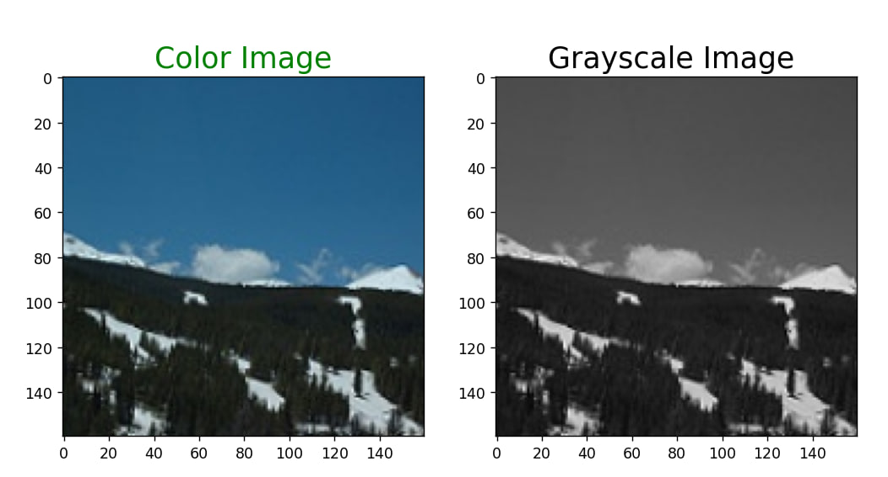
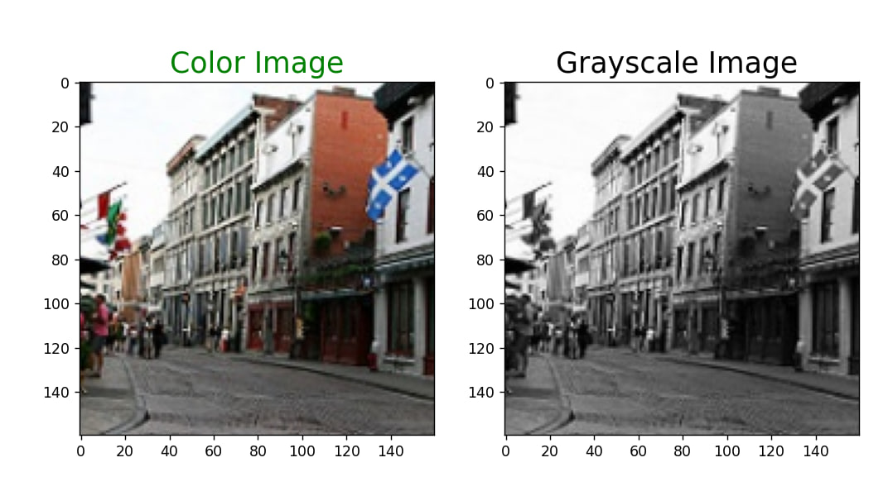
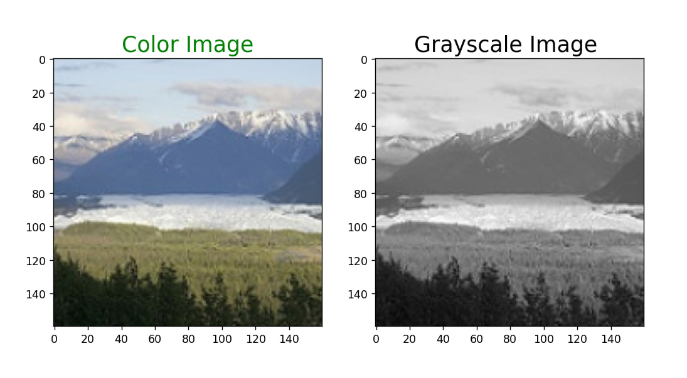
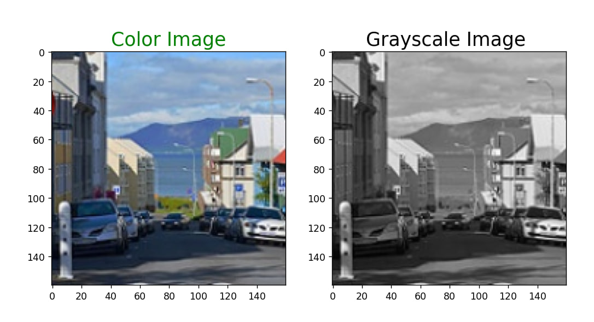
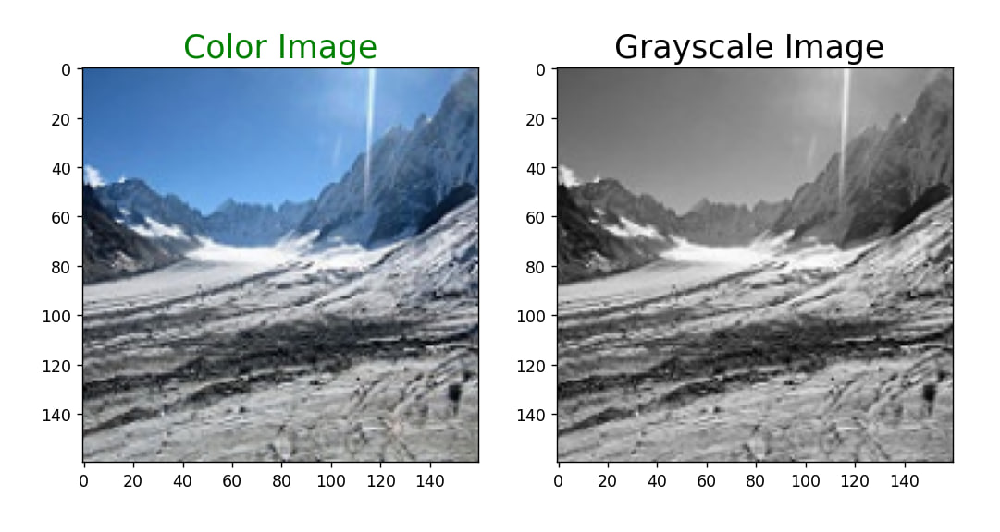

# ImageColorization

This project focuses on colorizing black and white images using a neural network. The goal is to convert grayscale images to color using a self-built and trained model.

## Prerequisites

To run this project, you need the following dependencies:

- Python (version 3.6 or higher)
- TensorFlow (version 2.0 or higher)
- Keras (version 2.4 or higher)
- OpenCV (version 4.2 or higher)
- NumPy (version 1.18 or higher)
- PIL (Python Imaging Library)
- Flask (version 2.3.2)

You can install these dependencies using pip. Run the following command to install the required packages:

`pip install tensorflow keras opencv-python numpy pillow`

If a message appears about the absence of some library, please go to the file **'requirements.txt'** and install the required version.

## How to Reproduce

To reproduce the image colorization process, follow these steps:

1. Clone the project repository:
		
	`git clone https://github.com/Nelijahk/ImageColorization.git`
		
2. If you only want to see the final program, proceed to step 6. Else download [dataset](https://www.kaggle.com/datasets/theblackmamba31/landscape-image-colorization) in the same directory as the project
		
4. To preprocessing data you need to run **'dataset_processing.py'**:

	```
	python dataset_processing.py
	```
	If everything goes well, you will get two new files **'color_img.pkl'** and **'gray_img.pkl'**.
4. To train model you need to run  **'train_model.py'**. 
	```
	python train_model.py
	```
	On average, training one epoch took 8 minutes, and I trained my model for 30 epochs. So, to avoid waiting, I recommend using the pre-trained model **'model(5)'** for colorization.
5. To colorize a test array of images, you need to run the **'predict.py'** file. 
	```
	python predict.py
	```
	It specifies that colorization will be performed using my trained model **'model(5)'**, but you can use your own pre-trained model if you prefer. You will 		get 3 randomly colorized images from the test array and the values of loss and accuracy at the output.
6. If you only want to use the entire program without running intermediate files, you can run the **'server.py'** file. 
	```
	python server.py
	```
	It will start the Flask server, and you will be able to access it locally (typically at http://127.0.0.1:5000). A web page will open where you can upload a 	grayscale image and obtain its colorized version. 
	
## Expected Inputs
The image colorization application accepts grayscale images in a supported format (e.g., JPEG, PNG) as input. You can upload their grayscale images through the web interface or provide the file path when running the script.

## Expected Results
The application will generate colorized versions of the grayscale images provided as input. The colorized images will be displayed on the web interface and saved to the specified output directory when running the script.

Additionally, the cross-validation script will provide evaluation metrics such as accuracy and loss during cross-validation, giving insights into the model's performance.

## Examples






## Conclusion
The image colorization project aims to automate the process of adding color to grayscale images. By following the steps mentioned above, you can train a model, preprocess data, generate features, and evaluate the model's performance. Deploying the application allows users to conveniently colorize their grayscale images and obtain the corresponding colorized versions.
